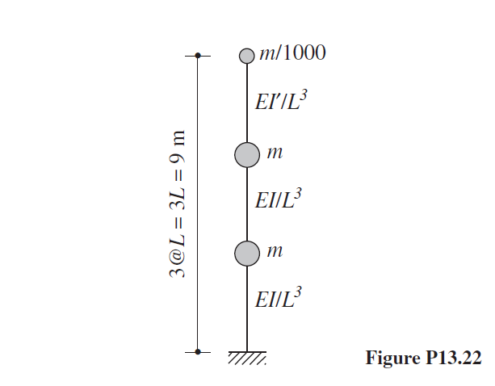

# Chopra Problem 13.22 | Cantilever Tower Dynamic Analysis

MATLAB implementation of Problem 13.22 from Anil K. Chopra's *Dynamics of Structures*: a three-DOF cantilever tower with an appendage mass, analyzed by classical modal analysis, the Newmark-β step-by-step integration method, and the response-spectrum (modal combination) approach under the El Centro ground motion.

## Problem Statement

The project reproduces, as an executable MATLAB script, the final-project assignment based on the following problem from Chopra:

> A cantilever tower is shown in Fig. P13.22 with three lumped masses and its flexural stiffness properties: $m = 114{,}750$ kg, $EI/L^3 = 9{,}000{,}000$ N/m, and $EI_t/L^3 = 900$ N/m. Note that the top mass and its supporting element are an appendage to the main tower. Damping is defined by modal damping ratios, with $\zeta_n = 5\%$ for first and third modes and Assume Rayleigh damping.
>
> The external load vector consists of two components: spatial and temporal:
> 
> $$
\mathbf{P(x,t)} = 
\begin{bmatrix}
1000 \\
0 \\
500 
\end{bmatrix} \mathbf{P(t)}
$$
> 
> **(1)** Determine the mass, stiffness and damping matrix.
> 
> **(2)** Determine the natural vibration periods, damping ratios and modes; sketch Compues.
> 
> **(3)** Using modal analysis of the structure subjected to a step load P(t) of magnitude 1 kips, determine:
>
>> (a) The time-history response of the roof displacement and interstory drift of the top story, and plot both.
>>
>> (b) The time-history response of the base shear and overturning moment of the structure, and plot both.
>>
>> (c) Plot the peak story displacement profile and the peak interstory drift profile over the height of the structure.
>>
>> (d) Determine the maximum base shear and maximum overturning moment.
>
> **(4)** Using modal analysis of the structure subjected to a sinusoidal load P(t) of amplitude 1 kips and frequency equal to the First natural frequency of the structure, determine:
>> repeat parts (a) through (d) of Section 3
>
> **(5)** Using modal analysis of the structure subjected to El Centro ground motion scaled to a peak ground acceleration of 0.65g (with no externally applied load), determine:
>> repeat parts (a) through (d) of Section 3
>
> **(6)** Using spectral analysis of the structure subjected to El Centro ground motion scaled to a peak ground acceleration of 0.65g (with no externally applied load), Compute the El Centro earthquake response spectrum separately for each modal damping ratio, and plot the results and determine:
>> repeat parts (c) and (d) of Section 3
>
> **(7)** Determine the effective modal mass M_n^* and the effective modal height h_n^*.

Because the appendage is much lighter and much more flexible than the main tower, this system is a classic illustration of tuning: the first two modes are dominated by the tower, while the third mode is localized almost entirely in the appendage. The script goes beyond parts (1)–(7) by runs forced-vibration history analyses (step load, resonant sinusoidal load, and the scaled El Centro record) using the Newmark-β method, plus a response-spectrum analysis with SRSS modal combination.

## Project Files

| File | Description |
|------|-------------|
| `structuralDynamicsChopra13-22.m` | Main MATLAB script: modal analysis, Rayleigh damping, Newmark-β integration, spectral analysis, and plotting |
| `ElCentro.txt` | Digitized ground acceleration record of the El Centro earthquake |
| `question.txt` | text version of the assignment |
| `requirements.txt` | MATLAB dependencies |
| `problemFig.png` | Figure of Problem 13.22 from Chopra's textbook |
| `2-theModeShapes.png` | Plot of structural vibration mode shapes |
| `3-A-theStoryDisplacementAndTopFloorDriftHistory.png` | Story displacement and top-floor drift history — Part 3-A |
| `3-B-theVBaseAndMBaseHistory.png` | Base shear and base moment history — Part 3-B |
| `3-C-MaxDisAndMaxDrift.png` | Maximum story displacement and drift — Part 3-C |
| `4-A-theStoryDisplacementAndTopFloorDriftHistory.png` | Story displacement and top-floor drift history — Part 4-A |
| `4-B-theVBaseAndMBaseHistory.png` | Base shear and base moment history — Part 4-B |
| `4-C-MaxDisAndMaxDrift.png` | Maximum story displacement and drift — Part 4-C |
| `5-A-theStoryDisplacementAndTopFloorDriftHistory.png` | Story displacement and top-floor drift history — Part 5-A |
| `5-B-theVBaseAndMBaseHistory.png` | Base shear and base moment history — Part 5-B |
| `5-C-MaxDisAndMaxDrift.png` | Maximum story displacement and drift — Part 5-C |
| `6-theResponseSpectral.png` | Structural response spectrum — Part 6 |

> Place `ElCentro.txt` in the same folder as the script before running Parts 5 and 6.

## Method Summary

**System matrices.** The user enters the three lumped masses $m_1$, $m_2$, $m_3$ (kg) and the flexural stiffness parameters $k_1$, $k_2$, $k_3$ (N/m). The diagonal mass matrix is $\mathbf{M} = \mathrm{diag}(m_1, m_2, m_3)$. The lateral stiffness matrix is assembled from the cantilever flexibility coefficients of the tower plus the appendage element, then inverted:

$$
\mathbf{K} = 
\begin{bmatrix}
\dfrac{1}{3k_1} & \dfrac{5}{6k_1} & \dfrac{4}{3k_1} \\
\dfrac{5}{6k_1} & \dfrac{8}{3k_1} & \dfrac{14}{3k_1} \\
\dfrac{4}{3k_1} & \dfrac{14}{3k_1} & \dfrac{26}{3k_1}+\dfrac{1}{3k_3}
\end{bmatrix}^{-1}
$$

The flexibility form follows from the unit-load deflections of the two-segment cantilever (main tower stiffness $k_1$, appendage stiffness $k_3$).

**Modal analysis.** The generalized eigenvalue problem $\mathbf{K}\boldsymbol{\phi} = \omega^2\mathbf{M}\boldsymbol{\phi}$ is solved with `eig(K, M)`. The code reports the natural frequencies $\omega_n$ (rad/s), $f_n = \omega_n/2\pi$ (Hz), the periods $T_n = 1/f_n$ (s), and plots the three mode shapes over the story levels with the base value fixed at zero.

**Damping (Rayleigh).** With $\zeta_1 = \zeta_3 = 0.05$ specified for the first and third modes, the classical Rayleigh damping coefficients are solved from

$$
\begin{bmatrix} 
1/\omega_1 & \omega_1 \\
1/\omega_3 & \omega_3
\end{bmatrix} \begin{bmatrix}
\alpha \\
\beta
\end{bmatrix} = 2\begin{bmatrix}
\zeta_1 \\
\zeta_3
\end{bmatrix}, \qquad \mathbf{C} = \alpha\mathbf{M} + \beta\mathbf{K}$$

and the resulting damping ratio in every mode is $\zeta_r = \frac{1}{2}\\left(\alpha/\omega_r + \beta\,\omega_r\right)$.

**Effective modal mass and height.** For each mode, with the influence vector $\boldsymbol{\iota} = [1;\,1;\,1]$ and story heights $\mathbf{h} = [3;\,6;\,9]$ m:

$$L_n = \boldsymbol{\phi}_n^T\mathbf{M}\boldsymbol{\iota}, \quad M_n = \boldsymbol{\phi}_n^T\mathbf{M}\boldsymbol{\phi}_n, \quad M_n^* = \frac{L_n^2}{M_n}, \quad h_n^* = \frac{\boldsymbol{\phi}_n^T\mathbf{M}\mathbf{h}}{L_n}$$

These quantities support the qualitative prediction of part (d): the tower base shear is dominated by the first mode, whereas the appendage displacement and appendage base shear are dominated by the third (appendage-localized) mode.

**Newmark-β time integration (parts 3–5).** The equation $\mathbf{M}\ddot{\mathbf{u}} + \mathbf{C}\dot{\mathbf{u}} + \mathbf{K}\mathbf{u} = \mathbf{p}(t)$ is integrated with the constant-average-acceleration scheme ($\gamma = 0.5$, $\beta = 0.25$, $\Delta t = 0.02$ s) using the effective-stiffness formulation:

$$\mathbf{K}_\text{eff} = \mathbf{K} + a_1\mathbf{M} + a_2\mathbf{C}$$

where

$$a_1 = \frac{1}{\beta\,\Delta t^2}, \quad a_2 = \frac{\gamma}{\beta\,\Delta t}, \quad a_3 = \frac{1}{2\beta}-1, \quad a_4 = \Delta t\!\left(\frac{\gamma}{2\beta}-1\right)$$

Three load cases are available:

- **Part 3 — step load:** $\mathbf{p} = [1000;\;0;\;500]\times 4448.22$ N (kips converted to Newtons), held constant in time.
- **Part 4 — resonant sinusoidal load:** $\mathbf{p} = [1000;\;0;\;500]\times 4448.22\cdot\sin(\omega_1 t)$, tuned to the first natural frequency.
- **Part 5 — El Centro time history:** the record is scaled to $\text{PGA} = 0.65g$ and applied as $\mathbf{p} = -\mathbf{M}\boldsymbol{\iota}\,\ddot{u}_g(t)$; modal coordinates $\mathbf{q}(t)$ are integrated and transformed back with $\mathbf{u} = \boldsymbol{\Phi}\mathbf{q}$.

**Response-quantity extraction.** For the history analyses the code computes the story displacements, the inter-story drifts (including the top-floor drift), the base shear $V = \boldsymbol{\iota}^T\mathbf{K}\mathbf{u}$, and the base overturning moment $M = \mathbf{h}^T\mathbf{K}\mathbf{u}$, and reports their maxima.

**Response-spectrum analysis (part 6).** A pseudo-acceleration response spectrum is constructed for the scaled El Centro record by running the same Newmark-β scheme on single-degree-of-freedom oscillators over $T_n = 0{:}0.01{:}5$ s. Spectral values at the system periods give the modal maxima, which are combined by the SRSS rule:

$$u_\text{max} = \sqrt{\sum_n \left(\boldsymbol{\phi}_n\,q_{n,0}\right)^2}$$

and similarly for the drifts, base shear, and overturning moment.

## Requirements

- MATLAB R2016b or newer (base MATLAB only; no toolboxes required).
- `ElCentro.txt` in the working directory (needed for Parts 5 and 6).

## How to Run

Open and run `chopra_13_22.m` in MATLAB. The script is interactive:

1. Enter the masses `M1`, `M2`, `M3` (kg) — e.g. `114750`, `114750`, `114.750`.
2. Enter the stiffness parameters `K1`, `K2`, `K3` (N/m) — e.g. `9000000`, `9000000`, `900`.
3. Choose an analysis part:
   - `3` — step-load history (Newmark-β)
   - `4` — sinusoidal load at $\omega_1$ (resonance)
   - `5` — El Centro time-history analysis (modal Newmark-β)
   - `6` — El Centro response-spectrum analysis (SRSS combination)
4. After the results, enter `0` to end or any other value to run another part.

## Output

**Terminal output:**

- Part 1 — mass matrix $\mathbf{M}$ (kg) and stiffness matrix $\mathbf{K}$ (N/m)
- Part 2 — damping matrix $\mathbf{C}$, natural periods $T_n$ (s), frequencies $f_n$ (Hz) and $\omega_n$ (rad/s), mode-shape matrix $\boldsymbol{\Phi}$, modal damping ratios $\zeta_n$
- Part 7 — effective modal masses $M_n^*$ (kg) and effective modal heights $h_n^*$ (m)
- Parts 3–5 — maximum base shear $V_\text{base}$ (kN) and maximum base overturning moment $M_\text{base}$ (kN·m)
- Part 6 — SRSS-combined maxima of story displacement and drift, and maximum base shear / overturning moment

**Figures generated:**

- The three mode shapes plotted over the story levels
- Story displacement histories $u_1(t)$, $u_2(t)$, $u_3(t)$ and the top-floor drift history
- Base shear and base moment histories
- Maximum story displacement and maximum story drift profiles
- (Part 6) the El Centro response spectrum $A/\ddot{u}_g$ versus $T_n$

## Notes

- This project was developed as the final project of a graduate Structural Dynamics course, implementing Chopra's Problem 13.22 (tower with an appendage) numerically.
- The script intentionally uses a menu-driven, formula-first style: every matrix and coefficient is built and displayed explicitly rather than hidden inside a solver function, so the numbers can be checked against the textbook solution.
- The record is normalized to $\text{PGA} = 0.65g$ inside the script, so any El Centro digitization with its native peak works consistently.
